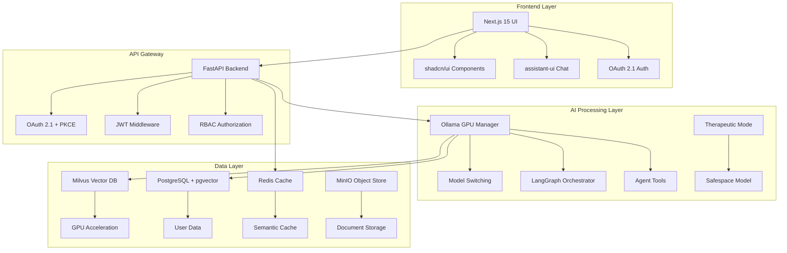

# JarvisAI 🤖

> **Production-Ready Self-Hosted AI Assistant with Advanced Capabilities**

<div align="center">

[](https://github.com/anubissbe/JarvisAI/actions/workflows/ci-cd.yml)
[](https://github.com/anubissbe/JarvisAI/actions/workflows/security.yml)
[](https://github.com/anubissbe/JarvisAI/actions/workflows/code-quality.yml)

[](https://www.python.org/downloads/)
[](https://fastapi.tiangolo.com/)
[](https://nextjs.org/)
[](https://www.docker.com/)
[](LICENSE)
[](JARVIS_TECH_VALIDATION_2025.md)

*A comprehensive AI assistant built with 2025's cutting-edge technologies*

</div>

---

## 🌟 Overview

JarvisAI is a production-ready, self-hosted AI assistant that leverages the latest 2025 technologies to deliver advanced capabilities including multi-modal RAG, therapeutic support, agent orchestration, and enterprise-grade security. Built for dual NVIDIA V100 GPUs with intelligent model switching and optimized for performance.

### ✨ Key Features

- 🧠 **Multi-Agent Orchestration** with LangGraph
- 🔒 **Enterprise Security** with OAuth 2.1 + PKCE
- 🚀 **GPU Acceleration** with NVIDIA CAGRA
- 💾 **Advanced RAG** with late chunking and semantic caching
- 🌍 **Multilingual Support** with BGE-M3 embeddings
- 📄 **Document Processing** with Docling + PaddleOCR
- 🎯 **Therapeutic Mode** with ADHD/autism support
- 📊 **Comprehensive Monitoring** with Prometheus + Grafana

---

## 🏗️ Architecture

<div align="center">



</div>

---

## 🚀 Quick Start

### Prerequisites

**Hardware Requirements:**
- CPU: 16+ cores recommended
- RAM: 256GB recommended (32GB minimum)
- GPU: Dual NVIDIA V100s (or similar with 32GB+ VRAM)
- Storage: 1TB+ NVMe SSD

**Software Requirements:**
- Docker 20.10+ with Compose v2
- NVIDIA Container Toolkit
- Git

### Installation

1. **Clone the Repository**
   ```bash
   git clone https://github.com/anubissbe/JarvisAI.git
   cd JarvisAI
   ```

2. **Environment Setup**
   ```bash
   # Copy environment template
   cp .env.example .env
   
   # Edit configuration
   nano .env
   ```

3. **Start Services**
   ```bash
   # Development environment (single GPU)
   docker-compose -f docker-compose.dev.yml up -d
   
   # Production environment (dual GPU)
   docker-compose up -d
   ```

4. **Initialize System**
   ```bash
   # Run setup script
   ./scripts/setup-dev-environment.sh
   
   # Load initial models
   ./scripts/setup-models.sh
   ```

5. **Access JarvisAI**
   - **Frontend**: http://localhost:3000
   - **API Documentation**: http://localhost:8000/docs
   - **Monitoring**: http://localhost:3001 (Grafana)

---

## 📁 Project Structure

```
JarvisAI/
├── 📋 Documentation/
│   ├── JARVIS_ARCHITECTURE_BLUEPRINT_2025.md    # Complete architecture
│   ├── JARVIS_TECH_VALIDATION_2025.md          # Research validation
│   ├── ARCHITECTURE_IMPROVEMENTS_2025.md        # 2025 updates
│   └── RESEARCH_UPDATE_SUMMARY.md              # Latest findings
│
├── 🔧 Backend/
│   ├── app/                                     # FastAPI application
│   ├── services/                               # Core services
│   └── requirements.txt                        # Dependencies
│
├── 🎨 Frontend/
│   ├── components/                             # React components
│   ├── pages/                                  # Next.js pages
│   └── package.json                           # Dependencies
│
├── 🤖 Services/
│   ├── ollama/                                 # LLM management
│   ├── vector-db/                             # Milvus configuration
│   ├── document-processor/                     # Docling + PaddleOCR
│   └── agent-orchestrator/                    # LangGraph workflows
│
├── 🐳 Infrastructure/
│   ├── docker/                                 # Container configs
│   ├── monitoring/                            # Prometheus + Grafana
│   └── docker-compose.yml                     # Production setup
│
└── 📝 Scripts/
    ├── setup-dev-environment.sh               # Development setup
    ├── setup-models.sh                        # Model initialization
    └── monitoring/                            # Health checks
```

---

## 🔧 Configuration

### Environment Variables

```bash
# Core Configuration
OLLAMA_GPUS=0,1                    # GPU allocation
MILVUS_GPU_ENABLED=true            # Enable GPU acceleration
REDIS_CACHE_ENABLED=true           # Semantic caching

# Security
OAUTH_CLIENT_ID=your_client_id
OAUTH_CLIENT_SECRET=your_secret
JWT_SECRET_KEY=your_jwt_secret

# Performance
MODEL_CACHE_SIZE=10GB              # Model cache size
VECTOR_BATCH_SIZE=1000             # Vector processing batch
```

### Model Configuration

```yaml
# models.yml
models:
  chat:
    name: "llama3.1:70b"
    gpu: 0
  embedding:
    name: "bge-m3"
    gpu: 1
  therapeutic:
    name: "safespace-7b"
    gpu: 0
```

---

## 🎯 Usage Examples

### Basic Chat Interaction

```python
import requests

response = requests.post("http://localhost:8000/api/v1/chat", json={
    "message": "Explain quantum computing",
    "user_id": "user123",
    "mode": "standard"
})
```

### Therapeutic Mode

```python
response = requests.post("http://localhost:8000/api/v1/chat", json={
    "message": "I'm feeling overwhelmed today",
    "user_id": "user123",
    "mode": "therapeutic"
})
```

### Document Processing

```python
# Upload and process document
files = {'file': open('document.pdf', 'rb')}
response = requests.post("http://localhost:8000/api/v1/documents/upload", files=files)

# Query document content
response = requests.post("http://localhost:8000/api/v1/documents/query", json={
    "query": "What are the key findings?",
    "document_id": "doc123"
})
```

---

## 🔬 Research & Validation

This project is backed by comprehensive research conducted in June 2025, validating all technology choices:

- ✅ **OAuth 2.1 with PKCE** (latest security standard)
- ✅ **Milvus with CAGRA** (10-20x vector search performance)
- ✅ **Next.js 15 + Turbopack** (76.7% faster builds)
- ✅ **LangGraph** (optimal for complex multi-agent workflows)
- ✅ **Late Chunking** (proven RAG best practice)
- ✅ **BGE-M3** (best multilingual embedding model)

See [JARVIS_TECH_VALIDATION_2025.md](JARVIS_TECH_VALIDATION_2025.md) for detailed research findings.

---

## 📊 Performance

### Benchmarks

| Component | Performance Improvement | Technology |
|-----------|------------------------|------------|
| Vector Search | 10-20x faster | NVIDIA CAGRA |
| Development Builds | 76.7% faster | Turbopack |
| Code Updates | 96.3% faster | Fast Refresh |
| LLM Caching | Up to 90% cost reduction | Redis Semantic Cache |
| Context Preservation | Significant improvement | Late Chunking |

### Hardware Utilization

- **GPU Utilization**: 70-87% (dual V100s)
- **Memory Usage**: Optimized for 256GB RAM
- **Storage**: Efficient with MinIO object storage
- **Network**: Optimized for local deployment

---

## 🧪 Development

### Development Setup

```bash
# Clone and setup
git clone https://github.com/anubissbe/JarvisAI.git
cd JarvisAI

# Development environment
docker-compose -f docker-compose.dev.yml up -d

# Install development dependencies
npm install                          # Frontend
pip install -r backend/requirements.txt  # Backend
```

### Testing

```bash
# Backend tests
cd backend && python -m pytest

# Frontend tests
cd frontend && npm test

# Integration tests
./scripts/run-integration-tests.sh
```

### Code Quality

```bash
# Linting
npm run lint                         # Frontend
flake8 backend/                      # Backend

# Type checking
npm run typecheck                    # Frontend
mypy backend/                        # Backend
```

---

## 🛠️ Deployment

### Production Deployment

```bash
# Production setup
docker-compose up -d

# Scale services
docker-compose up -d --scale backend=3
```

### Monitoring

- **Prometheus**: Metrics collection
- **Grafana**: Visualization dashboards
- **Loki**: Log aggregation
- **Health Checks**: Automated monitoring

### Backup & Recovery

```bash
# Backup data
./scripts/backup-data.sh

# Restore from backup
./scripts/restore-data.sh backup-2025-06-14.tar.gz
```

---

## 🤝 Contributing

We welcome contributions! Please see our [Contributing Guidelines](CONTRIBUTING.md) for details.

### Development Workflow

1. Fork the repository
2. Create a feature branch (`git checkout -b feature/amazing-feature`)
3. Commit your changes (`git commit -m 'Add amazing feature'`)
4. Push to the branch (`git push origin feature/amazing-feature`)
5. Open a Pull Request

### Code Standards

- Follow PEP 8 for Python code
- Use TypeScript for frontend development
- Include tests for new features
- Update documentation as needed

---

## 📄 License

This project is licensed under the MIT License - see the [LICENSE](LICENSE) file for details.

---

## 🙏 Acknowledgments

- Built with cutting-edge 2025 technologies
- Research-validated architecture
- Community-driven development
- Enterprise-ready deployment

---

## 📞 Support

- **Documentation**: [Full Architecture Guide](JARVIS_ARCHITECTURE_BLUEPRINT_2025.md)
- **Issues**: [GitHub Issues](https://github.com/anubissbe/JarvisAI/issues)
- **Discussions**: [GitHub Discussions](https://github.com/anubissbe/JarvisAI/discussions)

## ☕ Support the Project

If JarvisAI helps you or your organization, consider supporting its development:

<div align="center">

[](https://buymeacoffee.com/anubissbe)
[](https://github.com/sponsors/anubissbe)

*Your support helps maintain and improve JarvisAI for everyone* ❤️

</div>

### Why Support?

- 🚀 **Accelerate Development**: Faster feature implementation
- 🐛 **Better Support**: Priority bug fixes and responses
- 📚 **More Documentation**: Comprehensive guides and tutorials
- 🔬 **Research & Innovation**: Cutting-edge AI features
- 🌍 **Community Growth**: Better resources for everyone

---

<div align="center">

**JarvisAI** - Built for the future of AI assistance

[](https://github.com/anubissbe/JarvisAI)
[](https://buymeacoffee.com/anubissbe)

</div># Test trigger
