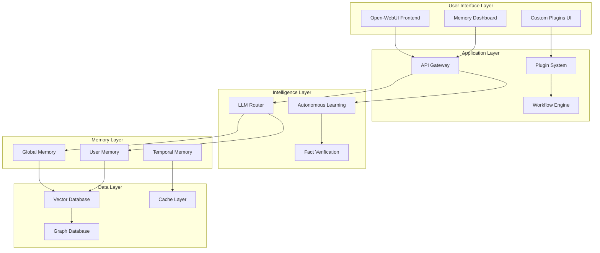

# JarvisAI-0.1 Architecture Documentation

## Table of Contents

1. [System Overview](#system-overview)
2. [Core Architecture Principles](#core-architecture-principles)
3. [Component Architecture](#component-architecture)
4. [Memory System Architecture](#memory-system-architecture)
5. [Learning Pipeline Architecture](#learning-pipeline-architecture)
6. [Data Flow Architecture](#data-flow-architecture)
7. [Integration Architecture](#integration-architecture)
8. [Security Architecture](#security-architecture)
9. [Scalability & Performance](#scalability--performance)
10. [Deployment Architecture](#deployment-architecture)

## System Overview

JarvisAI-0.1 is a self-learning AI assistant built on Open-WebUI that implements a sophisticated multi-layered architecture designed for autonomous learning, persistent memory, and continuous self-improvement.

### High-Level Architecture

